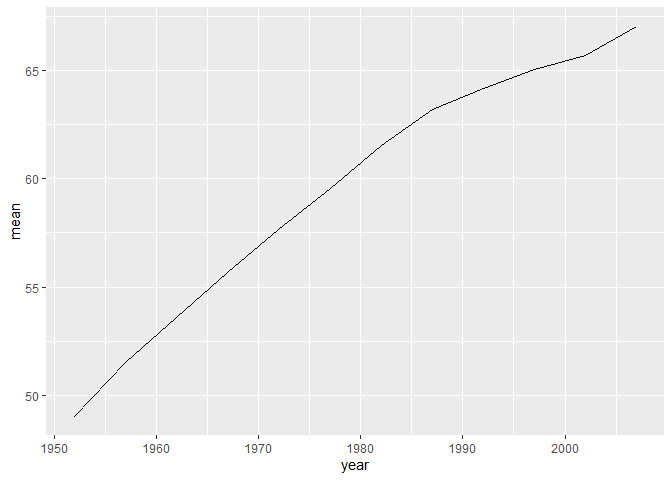
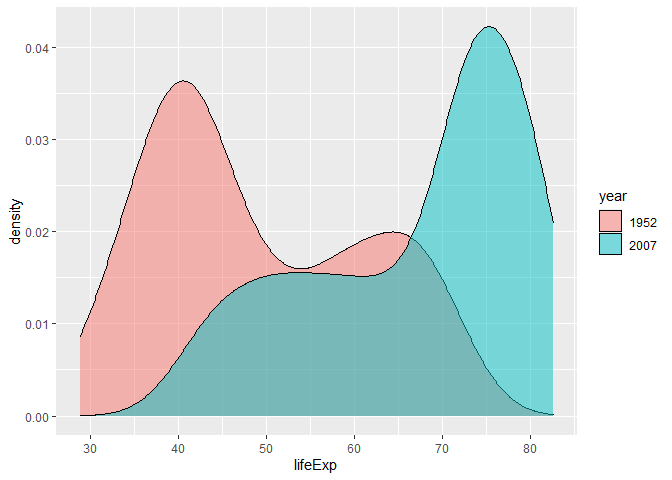
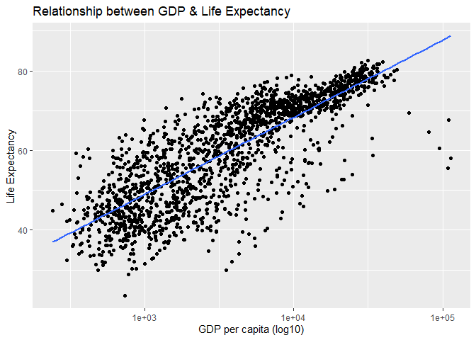
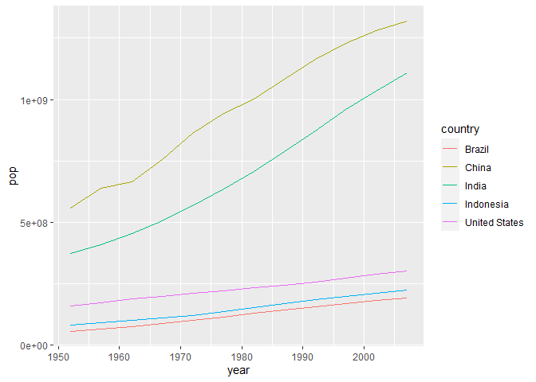
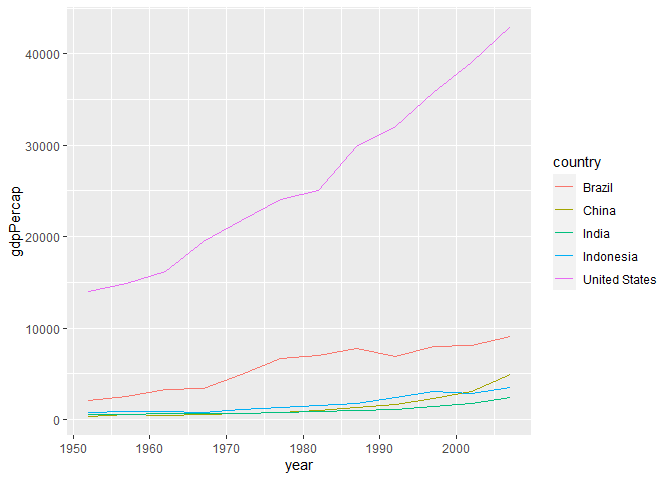
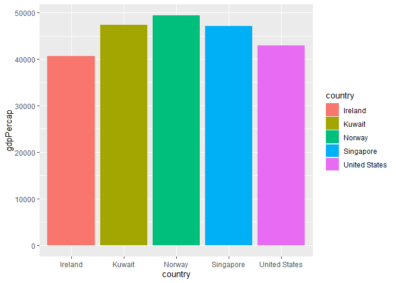

## Instructions
Answer the following questions and complete the exercises in RMarkdown. Please embed all of your code and push your final work to your repository. Your final lab report should be organized, clean, and run free from errors. Remember, you must remove the `#` for the included code chunks to run. Be sure to add your name to the author header above. For any included plots, make sure they are clearly labeled. You are free to use any plot type that you feel best communicates the results of your analysis.  

**In this homework, you should make use of the aesthetics you have learned. It's OK to be flashy!**

Make sure to use the formatting conventions of RMarkdown to make your report neat and clean!  

## Load the libraries

```r
library(tidyverse)
library(janitor)
library(here)
library(naniar)
```

## Resources
The idea for this assignment came from [Rebecca Barter's](http://www.rebeccabarter.com/blog/2017-11-17-ggplot2_tutorial/) ggplot tutorial so if you get stuck this is a good place to have a look.  

## Gapminder
For this assignment, we are going to use the dataset [gapminder](https://cran.r-project.org/web/packages/gapminder/index.html). Gapminder includes information about economics, population, and life expectancy from countries all over the world. You will need to install it before use. This is the same data that we will use for midterm 2 so this is good practice.

```r
#install.packages("gapminder")
library("gapminder")
```

## Questions
The questions below are open-ended and have many possible solutions. Your approach should, where appropriate, include numerical summaries and visuals. Be creative; assume you are building an analysis that you would ultimately present to an audience of stakeholders. Feel free to try out different `geoms` if they more clearly present your results.  

**1. Use the function(s) of your choice to get an idea of the overall structure of the data frame, including its dimensions, column names, variable classes, etc. As part of this, determine how NA's are treated in the data.**  

```r
gapminder
```

```
## # A tibble: 1,704 x 6
##    country     continent  year lifeExp      pop gdpPercap
##    <fct>       <fct>     <int>   <dbl>    <int>     <dbl>
##  1 Afghanistan Asia       1952    28.8  8425333      779.
##  2 Afghanistan Asia       1957    30.3  9240934      821.
##  3 Afghanistan Asia       1962    32.0 10267083      853.
##  4 Afghanistan Asia       1967    34.0 11537966      836.
##  5 Afghanistan Asia       1972    36.1 13079460      740.
##  6 Afghanistan Asia       1977    38.4 14880372      786.
##  7 Afghanistan Asia       1982    39.9 12881816      978.
##  8 Afghanistan Asia       1987    40.8 13867957      852.
##  9 Afghanistan Asia       1992    41.7 16317921      649.
## 10 Afghanistan Asia       1997    41.8 22227415      635.
## # ... with 1,694 more rows
```

```r
glimpse(gapminder)
```

```
## Rows: 1,704
## Columns: 6
## $ country   <fct> "Afghanistan", "Afghanistan", "Afghanistan", "Afghanistan", ~
## $ continent <fct> Asia, Asia, Asia, Asia, Asia, Asia, Asia, Asia, Asia, Asia, ~
## $ year      <int> 1952, 1957, 1962, 1967, 1972, 1977, 1982, 1987, 1992, 1997, ~
## $ lifeExp   <dbl> 28.801, 30.332, 31.997, 34.020, 36.088, 38.438, 39.854, 40.8~
## $ pop       <int> 8425333, 9240934, 10267083, 11537966, 13079460, 14880372, 12~
## $ gdpPercap <dbl> 779.4453, 820.8530, 853.1007, 836.1971, 739.9811, 786.1134, ~
```

```r
naniar::miss_var_summary(gapminder)
```

```
## # A tibble: 6 x 3
##   variable  n_miss pct_miss
##   <chr>      <int>    <dbl>
## 1 country        0        0
## 2 continent      0        0
## 3 year           0        0
## 4 lifeExp        0        0
## 5 pop            0        0
## 6 gdpPercap      0        0
```

```r
anyNA(gapminder)
```

```
## [1] FALSE
```


**2. Among the interesting variables in gapminder is life expectancy. How has global life expectancy changed between 1952 and 2007?**

```r
gapminder %>% 
  filter(between(year, 1952, 2007)) %>% 
  summarize(min=min(lifeExp),
            mean=mean(lifeExp),
            max=max(lifeExp))
```

```
## # A tibble: 1 x 3
##     min  mean   max
##   <dbl> <dbl> <dbl>
## 1  23.6  59.5  82.6
```

```r
gapminder %>% 
  group_by(year) %>% 
  summarize(min=min(lifeExp),
            mean=mean(lifeExp),
            max=max(lifeExp))
```

```
## # A tibble: 12 x 4
##     year   min  mean   max
##    <int> <dbl> <dbl> <dbl>
##  1  1952  28.8  49.1  72.7
##  2  1957  30.3  51.5  73.5
##  3  1962  32.0  53.6  73.7
##  4  1967  34.0  55.7  74.2
##  5  1972  35.4  57.6  74.7
##  6  1977  31.2  59.6  76.1
##  7  1982  38.4  61.5  77.1
##  8  1987  39.9  63.2  78.7
##  9  1992  23.6  64.2  79.4
## 10  1997  36.1  65.0  80.7
## 11  2002  39.2  65.7  82  
## 12  2007  39.6  67.0  82.6
```

```r
gapminder %>% 
  group_by(year) %>% 
  summarize(mean=mean(lifeExp)) %>% 
  ggplot(aes(x=year, y=mean))+
  geom_line()
```

<!-- -->


**3. How do the distributions of life expectancy compare for the years 1952 and 2007?**

```r
gapminder %>% 
  filter(year=="1952"|year=="2007") %>%
  mutate(year=as.factor(year)) %>% 
  ggplot(aes(x=lifeExp, group=year, fill=year))+
  geom_density(alpha=0.5)
```

<!-- -->

**4. Your answer above doesn't tell the whole story since life expectancy varies by region. Make a summary that shows the min, mean, and max life expectancy by continent for all years represented in the data.**

```r
gapminder %>% 
  group_by(continent, year) %>% 
  summarize(min=min(lifeExp),
            mean=mean(lifeExp),
            max=max(lifeExp))
```

```
## `summarise()` has grouped output by 'continent'. You can override using the
## `.groups` argument.
```

```
## # A tibble: 60 x 5
## # Groups:   continent [5]
##    continent  year   min  mean   max
##    <fct>     <int> <dbl> <dbl> <dbl>
##  1 Africa     1952  30    39.1  52.7
##  2 Africa     1957  31.6  41.3  58.1
##  3 Africa     1962  32.8  43.3  60.2
##  4 Africa     1967  34.1  45.3  61.6
##  5 Africa     1972  35.4  47.5  64.3
##  6 Africa     1977  36.8  49.6  67.1
##  7 Africa     1982  38.4  51.6  69.9
##  8 Africa     1987  39.9  53.3  71.9
##  9 Africa     1992  23.6  53.6  73.6
## 10 Africa     1997  36.1  53.6  74.8
## # ... with 50 more rows
```

**5. How has life expectancy changed between 1952-2007 for each continent?**

```r
gapminder %>% 
  group_by(continent, year) %>% 
  summarize(mean=mean(lifeExp)) %>% 
  ggplot(aes(x=year, y=mean, group=continent, color=continent))+
  geom_line()
```

```
## `summarise()` has grouped output by 'continent'. You can override using the
## `.groups` argument.
```

<!-- -->

**6. We are interested in the relationship between per capita GDP and life expectancy; i.e. does having more money help you live longer?**

```r
names(gapminder)
```

```
## [1] "country"   "continent" "year"      "lifeExp"   "pop"       "gdpPercap"
```


```r
gapminder %>% 
  ggplot(aes(x=gdpPercap, y=lifeExp))+
  geom_point()+
  scale_x_log10()+
  geom_smooth(method = lm, se=F)+
  labs(title = "Relationship between GDP & Life Expectancy",
       x="GDP per capita (log10)",
       y="Life Expectancy")
```

```
## `geom_smooth()` using formula 'y ~ x'
```

<!-- -->

**7. Which countries have had the largest population growth since 1952?**

```r
gapminder %>% 
  select(country, year, pop) %>% 
  filter(year=="1952"|year=="2007") %>% 
  pivot_wider(names_from= year,
              names_prefix = "yr_",
              values_from = pop) %>% 
  
  mutate(delta=yr_2007-yr_1952) %>% 
  arrange(desc(delta))
```

```
## # A tibble: 142 x 4
##    country         yr_1952    yr_2007     delta
##    <fct>             <int>      <int>     <int>
##  1 China         556263527 1318683096 762419569
##  2 India         372000000 1110396331 738396331
##  3 United States 157553000  301139947 143586947
##  4 Indonesia      82052000  223547000 141495000
##  5 Brazil         56602560  190010647 133408087
##  6 Pakistan       41346560  169270617 127924057
##  7 Bangladesh     46886859  150448339 103561480
##  8 Nigeria        33119096  135031164 101912068
##  9 Mexico         30144317  108700891  78556574
## 10 Philippines    22438691   91077287  68638596
## # ... with 132 more rows
```

**8. Use your results from the question above to plot population growth for the top five countries since 1952.**

```r
gapminder %>% 
  filter(country=="China"| country=="India"| country=="United States"| country=="Indonesia"| country=="Brazil") %>% 
  select(year, country, pop) %>% 
  ggplot(aes(x=year, y=pop, color=country))+
  geom_line()
```

<!-- -->

**9. How does per-capita GDP growth compare between these same five countries?**

```r
gapminder %>% 
  filter(country=="China"| country=="India"| country=="United States"| country=="Indonesia"| country=="Brazil") %>% 
  select(year, country, gdpPercap) %>% 
  ggplot(aes(x=year, y=gdpPercap, group=country, color=country))+
  geom_line()
```

<!-- -->

**10. Make one plot of your choice that uses faceting!**

```r
gapminder %>% 
  select(country, year, gdpPercap) %>% 
  filter(year=="2007") %>% 
  arrange(desc(gdpPercap))
```

```
## # A tibble: 142 x 3
##    country           year gdpPercap
##    <fct>            <int>     <dbl>
##  1 Norway            2007    49357.
##  2 Kuwait            2007    47307.
##  3 Singapore         2007    47143.
##  4 United States     2007    42952.
##  5 Ireland           2007    40676.
##  6 Hong Kong, China  2007    39725.
##  7 Switzerland       2007    37506.
##  8 Netherlands       2007    36798.
##  9 Canada            2007    36319.
## 10 Iceland           2007    36181.
## # ... with 132 more rows
```

```r
gapminder %>% 
  filter(year=="2007") %>% 
  filter(country=="Norway"| country=="Kuwait"| country=="Singapore"| country=="United States"| country=="Ireland") %>% 
  select(country, year, gdpPercap) %>%
  ggplot(aes(x=country, y=gdpPercap, group=year, fill=country))+
  geom_col()
```

<!-- -->

## Push your final code to GitHub!
Please be sure that you check the `keep md` file in the knit preferences. 
