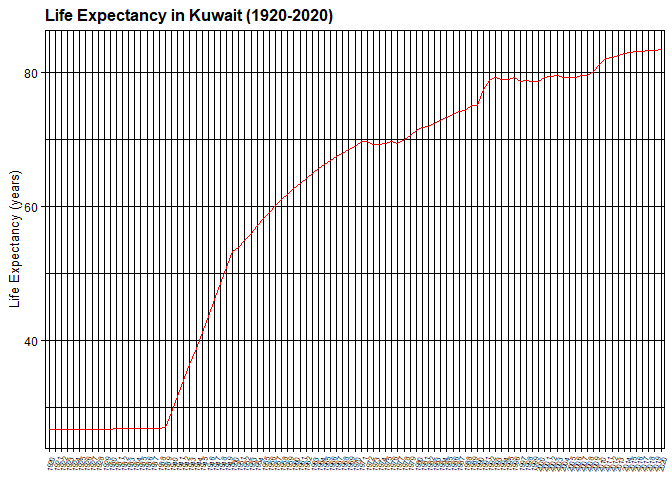
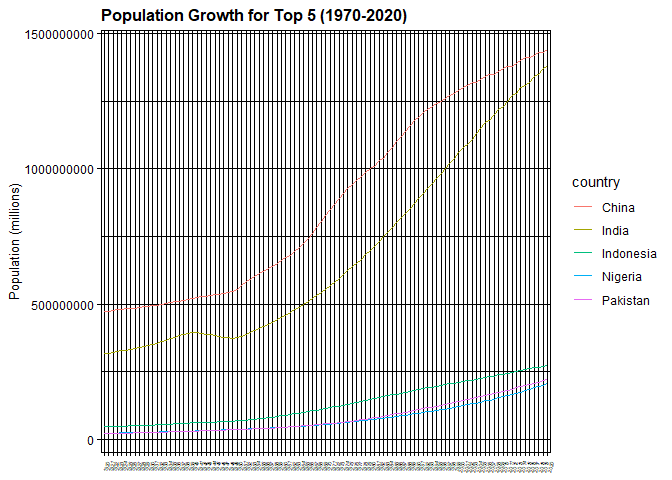
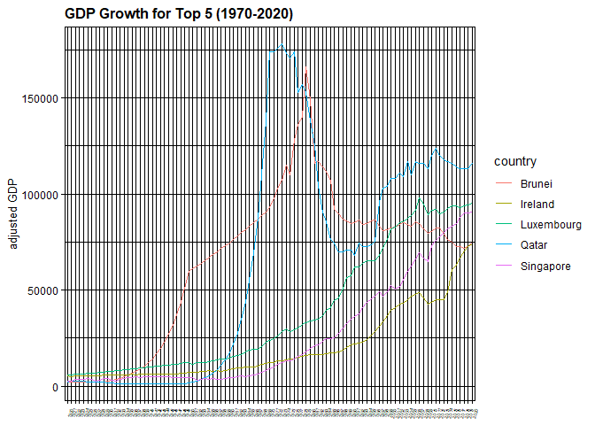
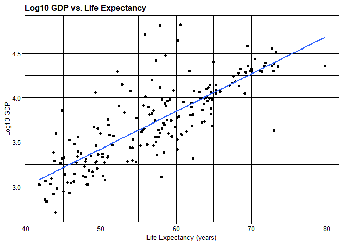

## Instructions
Answer the following questions and complete the exercises in RMarkdown. Please embed all of your code and push your final work to your repository. Your code should be organized, clean, and run free from errors. Be sure to **add your name** to the author header above. You may use any resources to answer these questions (including each other), but you may not post questions to Open Stacks or external help sites. There are 10 total questions.  

Make sure to use the formatting conventions of RMarkdown to make your report neat and clean! Your plots should use consistent aesthetics throughout.  

This exam is due by **12:00p on Tuesday, February 22**.  

## Gapminder
For this assignment, we are going to use data from  [gapminder](https://www.gapminder.org/). Gapminder includes information about economics, population, social issues, and life expectancy from countries all over the world. We will use three data sets, so please load all three as separate objects.    

1. population_total.csv  
2. income_per_person_gdppercapita_ppp_inflation_adjusted.csv  
3. life_expectancy_years.csv  


```r
library(tidyverse)
```

```
## -- Attaching packages --------------------------------------- tidyverse 1.3.1 --
```

```
## v ggplot2 3.3.5     v purrr   0.3.4
## v tibble  3.1.6     v dplyr   1.0.8
## v tidyr   1.2.0     v stringr 1.4.0
## v readr   2.1.2     v forcats 0.5.1
```

```
## -- Conflicts ------------------------------------------ tidyverse_conflicts() --
## x dplyr::filter() masks stats::filter()
## x dplyr::lag()    masks stats::lag()
```

```r
library(RColorBrewer)
library(paletteer)
library(janitor)
```

```
## 
##  次のパッケージを付け加えます: 'janitor'
```

```
##  以下のオブジェクトは 'package:stats' からマスクされています: 
## 
##      chisq.test, fisher.test
```

```r
library(here)
```

```
## here() starts at C:/Users/KAREN/Documents/GitHub/BIS15W2022_karen-kyutoku
```

```r
options(scipen=999) #disables scientific notation when printing
```


```r
population <- read_csv(here("midterm2", "data", "population_total.csv"))
```

```
## Rows: 195 Columns: 302
## -- Column specification --------------------------------------------------------
## Delimiter: ","
## chr   (1): country
## dbl (301): 1800, 1801, 1802, 1803, 1804, 1805, 1806, 1807, 1808, 1809, 1810,...
## 
## i Use `spec()` to retrieve the full column specification for this data.
## i Specify the column types or set `show_col_types = FALSE` to quiet this message.
```

```r
income <- read_csv(here("midterm2", "data", "income_per_person_gdppercapita_ppp_inflation_adjusted.csv"))
```

```
## Rows: 193 Columns: 242
## -- Column specification --------------------------------------------------------
## Delimiter: ","
## chr   (1): country
## dbl (241): 1800, 1801, 1802, 1803, 1804, 1805, 1806, 1807, 1808, 1809, 1810,...
## 
## i Use `spec()` to retrieve the full column specification for this data.
## i Specify the column types or set `show_col_types = FALSE` to quiet this message.
```

```r
life_expectancy <- read_csv(here("midterm2", "data", "life_expectancy_years.csv"))
```

```
## Rows: 187 Columns: 302
## -- Column specification --------------------------------------------------------
## Delimiter: ","
## chr   (1): country
## dbl (301): 1800, 1801, 1802, 1803, 1804, 1805, 1806, 1807, 1808, 1809, 1810,...
## 
## i Use `spec()` to retrieve the full column specification for this data.
## i Specify the column types or set `show_col_types = FALSE` to quiet this message.
```

1. (3 points) Once you have an idea of the structure of the data, please make each data set tidy (hint: think back to pivots) and store them as new objects. You will need both the original (wide) and tidy (long) data!  


```r
population
```

```
## # A tibble: 195 x 302
##    country `1800` `1801` `1802` `1803` `1804` `1805` `1806` `1807` `1808` `1809`
##    <chr>    <dbl>  <dbl>  <dbl>  <dbl>  <dbl>  <dbl>  <dbl>  <dbl>  <dbl>  <dbl>
##  1 Afghan~ 3.28e6 3.28e6 3.28e6 3.28e6 3.28e6 3.28e6 3.28e6 3.28e6 3.28e6 3.28e6
##  2 Albania 4   e5 4.02e5 4.04e5 4.05e5 4.07e5 4.09e5 4.11e5 4.13e5 4.14e5 4.16e5
##  3 Algeria 2.5 e6 2.51e6 2.52e6 2.53e6 2.54e6 2.55e6 2.56e6 2.56e6 2.57e6 2.58e6
##  4 Andorra 2.65e3 2.65e3 2.65e3 2.65e3 2.65e3 2.65e3 2.65e3 2.65e3 2.65e3 2.65e3
##  5 Angola  1.57e6 1.57e6 1.57e6 1.57e6 1.57e6 1.57e6 1.57e6 1.57e6 1.57e6 1.57e6
##  6 Antigu~ 3.7 e4 3.7 e4 3.7 e4 3.7 e4 3.7 e4 3.7 e4 3.7 e4 3.7 e4 3.7 e4 3.7 e4
##  7 Argent~ 5.34e5 5.2 e5 5.06e5 4.92e5 4.79e5 4.66e5 4.53e5 4.41e5 4.29e5 4.17e5
##  8 Armenia 4.13e5 4.13e5 4.13e5 4.13e5 4.13e5 4.13e5 4.13e5 4.13e5 4.13e5 4.13e5
##  9 Austra~ 2   e5 2.05e5 2.11e5 2.16e5 2.22e5 2.27e5 2.33e5 2.39e5 2.46e5 2.52e5
## 10 Austria 3   e6 3.02e6 3.04e6 3.05e6 3.07e6 3.09e6 3.11e6 3.12e6 3.14e6 3.16e6
## # ... with 185 more rows, and 291 more variables: `1810` <dbl>, `1811` <dbl>,
## #   `1812` <dbl>, `1813` <dbl>, `1814` <dbl>, `1815` <dbl>, `1816` <dbl>,
## #   `1817` <dbl>, `1818` <dbl>, `1819` <dbl>, `1820` <dbl>, `1821` <dbl>,
## #   `1822` <dbl>, `1823` <dbl>, `1824` <dbl>, `1825` <dbl>, `1826` <dbl>,
## #   `1827` <dbl>, `1828` <dbl>, `1829` <dbl>, `1830` <dbl>, `1831` <dbl>,
## #   `1832` <dbl>, `1833` <dbl>, `1834` <dbl>, `1835` <dbl>, `1836` <dbl>,
## #   `1837` <dbl>, `1838` <dbl>, `1839` <dbl>, `1840` <dbl>, `1841` <dbl>, ...
```


```r
population_long <- population %>% 
  pivot_longer(-country, 
               names_to = "year", 
               values_to = "popuation") %>% 
  mutate(country=as_factor(country))
               
population_long
```

```
## # A tibble: 58,695 x 3
##    country     year  popuation
##    <fct>       <chr>     <dbl>
##  1 Afghanistan 1800    3280000
##  2 Afghanistan 1801    3280000
##  3 Afghanistan 1802    3280000
##  4 Afghanistan 1803    3280000
##  5 Afghanistan 1804    3280000
##  6 Afghanistan 1805    3280000
##  7 Afghanistan 1806    3280000
##  8 Afghanistan 1807    3280000
##  9 Afghanistan 1808    3280000
## 10 Afghanistan 1809    3280000
## # ... with 58,685 more rows
```


```r
income
```

```
## # A tibble: 193 x 242
##    country `1800` `1801` `1802` `1803` `1804` `1805` `1806` `1807` `1808` `1809`
##    <chr>    <dbl>  <dbl>  <dbl>  <dbl>  <dbl>  <dbl>  <dbl>  <dbl>  <dbl>  <dbl>
##  1 Afghan~    603    603    603    603    603    603    603    603    603    603
##  2 Albania    667    667    667    667    667    668    668    668    668    668
##  3 Algeria    715    716    717    718    719    720    721    722    723    724
##  4 Andorra   1200   1200   1200   1200   1210   1210   1210   1210   1220   1220
##  5 Angola     618    620    623    626    628    631    634    637    640    642
##  6 Antigu~    757    757    757    757    757    757    757    758    758    758
##  7 Argent~   1640   1640   1650   1650   1660   1660   1670   1680   1680   1690
##  8 Armenia    514    514    514    514    514    514    514    514    514    514
##  9 Austra~    817    822    826    831    836    841    845    850    855    860
## 10 Austria   1850   1850   1860   1870   1880   1880   1890   1900   1910   1920
## # ... with 183 more rows, and 231 more variables: `1810` <dbl>, `1811` <dbl>,
## #   `1812` <dbl>, `1813` <dbl>, `1814` <dbl>, `1815` <dbl>, `1816` <dbl>,
## #   `1817` <dbl>, `1818` <dbl>, `1819` <dbl>, `1820` <dbl>, `1821` <dbl>,
## #   `1822` <dbl>, `1823` <dbl>, `1824` <dbl>, `1825` <dbl>, `1826` <dbl>,
## #   `1827` <dbl>, `1828` <dbl>, `1829` <dbl>, `1830` <dbl>, `1831` <dbl>,
## #   `1832` <dbl>, `1833` <dbl>, `1834` <dbl>, `1835` <dbl>, `1836` <dbl>,
## #   `1837` <dbl>, `1838` <dbl>, `1839` <dbl>, `1840` <dbl>, `1841` <dbl>, ...
```


```r
income_long <- income %>% 
  pivot_longer(-country, 
               names_to = "year", 
               values_to = "income") %>% 
  mutate(country=as_factor(country))
               
income_long
```

```
## # A tibble: 46,513 x 3
##    country     year  income
##    <fct>       <chr>  <dbl>
##  1 Afghanistan 1800     603
##  2 Afghanistan 1801     603
##  3 Afghanistan 1802     603
##  4 Afghanistan 1803     603
##  5 Afghanistan 1804     603
##  6 Afghanistan 1805     603
##  7 Afghanistan 1806     603
##  8 Afghanistan 1807     603
##  9 Afghanistan 1808     603
## 10 Afghanistan 1809     603
## # ... with 46,503 more rows
```

```r
life_expectancy
```

```
## # A tibble: 187 x 302
##    country `1800` `1801` `1802` `1803` `1804` `1805` `1806` `1807` `1808` `1809`
##    <chr>    <dbl>  <dbl>  <dbl>  <dbl>  <dbl>  <dbl>  <dbl>  <dbl>  <dbl>  <dbl>
##  1 Afghan~   28.2   28.2   28.2   28.2   28.2   28.2   28.1   28.1   28.1   28.1
##  2 Albania   35.4   35.4   35.4   35.4   35.4   35.4   35.4   35.4   35.4   35.4
##  3 Algeria   28.8   28.8   28.8   28.8   28.8   28.8   28.8   28.8   28.8   28.8
##  4 Andorra   NA     NA     NA     NA     NA     NA     NA     NA     NA     NA  
##  5 Angola    27     27     27     27     27     27     27     27     27     27  
##  6 Antigu~   33.5   33.5   33.5   33.5   33.5   33.5   33.5   33.5   33.5   33.5
##  7 Argent~   33.2   33.2   33.2   33.2   33.2   33.2   33.2   33.2   33.2   33.2
##  8 Armenia   34     34     34     34     34     34     34     34     34     34  
##  9 Austra~   34     34     34     34     34     34     34     34     34     34  
## 10 Austria   34.4   34.4   34.4   34.4   34.4   34.4   34.4   34.4   34.4   34.4
## # ... with 177 more rows, and 291 more variables: `1810` <dbl>, `1811` <dbl>,
## #   `1812` <dbl>, `1813` <dbl>, `1814` <dbl>, `1815` <dbl>, `1816` <dbl>,
## #   `1817` <dbl>, `1818` <dbl>, `1819` <dbl>, `1820` <dbl>, `1821` <dbl>,
## #   `1822` <dbl>, `1823` <dbl>, `1824` <dbl>, `1825` <dbl>, `1826` <dbl>,
## #   `1827` <dbl>, `1828` <dbl>, `1829` <dbl>, `1830` <dbl>, `1831` <dbl>,
## #   `1832` <dbl>, `1833` <dbl>, `1834` <dbl>, `1835` <dbl>, `1836` <dbl>,
## #   `1837` <dbl>, `1838` <dbl>, `1839` <dbl>, `1840` <dbl>, `1841` <dbl>, ...
```


```r
life_expectancy_long <- life_expectancy %>% 
  pivot_longer(-country, 
               names_to = "year", 
               values_to = "life_expectancy") %>% 
  mutate(country=as_factor(country))
               
life_expectancy_long
```

```
## # A tibble: 56,287 x 3
##    country     year  life_expectancy
##    <fct>       <chr>           <dbl>
##  1 Afghanistan 1800             28.2
##  2 Afghanistan 1801             28.2
##  3 Afghanistan 1802             28.2
##  4 Afghanistan 1803             28.2
##  5 Afghanistan 1804             28.2
##  6 Afghanistan 1805             28.2
##  7 Afghanistan 1806             28.1
##  8 Afghanistan 1807             28.1
##  9 Afghanistan 1808             28.1
## 10 Afghanistan 1809             28.1
## # ... with 56,277 more rows
```


2. (1 point) How many different countries are represented in the data? Provide the total number and their names. Since each data set includes different numbers of countries, you will need to do this for each one.  

```r
population_long %>% 
  summarize(n_countries=n_distinct(country))
```

```
## # A tibble: 1 x 1
##   n_countries
##         <int>
## 1         195
```

```r
population_long %>% 
  count(country) %>% 
  select(country)
```

```
## # A tibble: 195 x 1
##    country            
##    <fct>              
##  1 Afghanistan        
##  2 Albania            
##  3 Algeria            
##  4 Andorra            
##  5 Angola             
##  6 Antigua and Barbuda
##  7 Argentina          
##  8 Armenia            
##  9 Australia          
## 10 Austria            
## # ... with 185 more rows
```

```r
life_expectancy_long %>% 
  summarize(n_countries=n_distinct(country))
```

```
## # A tibble: 1 x 1
##   n_countries
##         <int>
## 1         187
```

```r
life_expectancy_long %>% 
  count(country) %>% 
  select(country)
```

```
## # A tibble: 187 x 1
##    country            
##    <fct>              
##  1 Afghanistan        
##  2 Albania            
##  3 Algeria            
##  4 Andorra            
##  5 Angola             
##  6 Antigua and Barbuda
##  7 Argentina          
##  8 Armenia            
##  9 Australia          
## 10 Austria            
## # ... with 177 more rows
```

```r
income_long %>% 
  summarize(n_countries=n_distinct(country))
```

```
## # A tibble: 1 x 1
##   n_countries
##         <int>
## 1         193
```

```r
income_long %>% 
  count(country) %>% 
  select(country)
```

```
## # A tibble: 193 x 1
##    country            
##    <fct>              
##  1 Afghanistan        
##  2 Albania            
##  3 Algeria            
##  4 Andorra            
##  5 Angola             
##  6 Antigua and Barbuda
##  7 Argentina          
##  8 Armenia            
##  9 Australia          
## 10 Austria            
## # ... with 183 more rows
```

## Life Expectancy  

3. (2 points) Let's limit the data to 100 years (1920-2020). For these years, which country has the highest average life expectancy? How about the lowest average life expectancy?  

Higest

```r
life_expectancy_long %>% 
  filter(between(year, 1920, 2020)) %>% 
  group_by(country) %>% 
  summarize(mean_life_expectancy=mean(life_expectancy)) %>% 
  arrange(desc(mean_life_expectancy))
```

```
## # A tibble: 187 x 2
##    country        mean_life_expectancy
##    <fct>                         <dbl>
##  1 Sweden                         73.5
##  2 Norway                         73.2
##  3 Netherlands                    73.0
##  4 Iceland                        72.9
##  5 Australia                      72.7
##  6 Switzerland                    72.7
##  7 Denmark                        71.9
##  8 Canada                         71.8
##  9 New Zealand                    71.4
## 10 United Kingdom                 71.1
## # ... with 177 more rows
```
Lowest

```r
life_expectancy_long %>% 
  filter(between(year, 1920, 2020)) %>% 
  group_by(country) %>% 
  summarize(mean_life_expectancy=mean(life_expectancy)) %>% 
  arrange(mean_life_expectancy)
```

```
## # A tibble: 187 x 2
##    country                  mean_life_expectancy
##    <fct>                                   <dbl>
##  1 Central African Republic                 41.8
##  2 Mali                                     41.8
##  3 Ethiopia                                 42.6
##  4 Sierra Leone                             42.6
##  5 Guinea-Bissau                            42.6
##  6 Burundi                                  42.8
##  7 Malawi                                   42.8
##  8 Uganda                                   43.3
##  9 Eritrea                                  43.4
## 10 Yemen                                    43.6
## # ... with 177 more rows
```

4. (3 points) Although we can see which country has the highest life expectancy for the past 100 years, we don't know which countries have changed the most. What are the top 5 countries that have experienced the biggest improvement in life expectancy between 1920-2020?  

```r
life_expectancy_long %>% 
  filter(between(year, 1920, 2020)) %>% 
  pivot_wider(names_from = year,
              values_from = life_expectancy) %>% 
  select(country, `1920`, `2020`) %>% 
  mutate(delta=`2020`-`1920`) %>% 
  top_n(5, delta)
```

```
## # A tibble: 5 x 4
##   country         `1920` `2020` delta
##   <fct>            <dbl>  <dbl> <dbl>
## 1 Kuwait            26.6   83.4  56.8
## 2 Kyrgyz Republic   16.6   73.1  56.5
## 3 South Korea       28.2   83.2  55  
## 4 Tajikistan        16.7   71    54.3
## 5 Turkmenistan      15.2   70.5  55.3
```

5. (3 points) Make a plot that shows the change over the past 100 years for the country with the biggest improvement in life expectancy. Be sure to add appropriate aesthetics to make the plot clean and clear. Once you have made the plot, do a little internet searching and see if you can discover what historical event may have contributed to this remarkable change. 

In 1938, oil was discovered in Kuwait.


```r
kuwait <- life_expectancy_long %>% 
  filter(country=="Kuwait") %>% 
  filter(between(year, 1920, 2020)) %>% 
  select(year, life_expectancy) %>% 
  ggplot(aes(x=year, y=life_expectancy, group=1))+
  geom_line(color="red")
```


```r
kuwait+
  theme_linedraw()+
  theme(plot.title = element_text(size=12, face="bold"),
        axis.title = element_text(size=10),
        axis.text.x = element_text(angle=75, hjust = 1, size=5))+
  labs(title = "Life Expectancy in Kuwait (1920-2020)",
       x=NULL,
       y= "Life Expectancy (years)")
```

<!-- -->

## Population Growth
6. (3 points) Which 5 countries have had the highest population growth over the past 100 years (1920-2020)?  


```r
#population_long %>% 
  #filter(between(year, 1920, 2020)) %>% 
  #filter(year=="1920" | year=="2020") %>% 
  #pivot_wider(names_from = year,
              #values_from = population) %>% 
  #mutate(delta=`2020`-`1920`) %>% 
  #top_n(5, delta) %>% 
  #arrange(desc(delta))
```


7. (4 points) Produce a plot that shows the 5 countries that have had the highest population growth over the past 100 years (1920-2020). Which countries appear to have had exponential growth?  

India and China


```r
population %>% 
  filter(country=="India" | country=="China" | country=="Pakistan" | country=="Indonesia" | country=="Nigeria") %>% 
  pivot_longer(-country,
               names_to = "year",
               values_to="population") %>% 
  filter(year>=1920 & year<=2020) %>% 
  ggplot(aes(x=year, y=population, group=country, color=country))+
  geom_line()+
  theme_linedraw()+
  theme(plot.title = element_text(size = 12, face = "bold"),
        axis.title = element_text(size = 10),
        axis.text.x = element_text(angle=75, hjust = 1, size=4)) +
  labs(title = "Population Growth for Top 5 (1970-2020)",
       x = NULL,
       y = "Population (millions)")
```

<!-- -->

## Income
The units used for income are gross domestic product per person adjusted for differences in purchasing power in international dollars.

8. (4 points) As in the previous questions, which countries have experienced the biggest growth in per person GDP. Show this as a table and then plot the changes for the top 5 countries. With a bit of research, you should be able to explain the dramatic downturns of the wealthiest economies that occurred during the 1980's.  

```r
income_long %>% 
  filter(between(year, 1920, 2020)) %>% 
  filter(year=="1920" | year=="2020") %>% 
  pivot_wider(names_from = year,
              values_from = income) %>% 
  mutate(delta=`2020`-`1920`) %>% 
  top_n(5, delta) %>% 
  arrange(desc(delta))
```

```
## # A tibble: 5 x 4
##   country    `1920` `2020`  delta
##   <fct>       <dbl>  <dbl>  <dbl>
## 1 Qatar        2300 116000 113700
## 2 Luxembourg   5730  95100  89370
## 3 Singapore    2440  90500  88060
## 4 Brunei       2130  75100  72970
## 5 Ireland      5170  74100  68930
```

```r
income %>% 
  filter(country=="Qatar" | country=="Luxembourg" | country=="Singapore" | country=="Brunei" | country=="Ireland") %>% 
  pivot_longer(-country,
               names_to = "year",
               values_to="income") %>% 
  filter(year>=1920 & year<=2020) %>% 
  ggplot(aes(x=as.factor(year), y=income, group=country, color=country))+
  geom_line()+
  theme_linedraw()+
  theme(plot.title = element_text(size = 12, face = "bold"),
        axis.title = element_text(size = 10),
        axis.text.x = element_text(angle=75, hjust = 1, size=4)) +
  labs(title = "GDP Growth for Top 5 (1970-2020)",
       x = NULL,
       y = "adjusted GDP")
```

<!-- -->


9. (3 points) Create three new objects that restrict each data set (life expectancy, population, income) to the years 1920-2020. Hint: I suggest doing this with the long form of your data. Once this is done, merge all three data sets using the code I provide below. You may need to adjust the code depending on how you have named your objects. I called mine `life_expectancy_100`, `population_100`, and `income_100`. For some of you, learning these `joins` will be important for your project.  


```r
life_expectancy_100 <- 
  life_expectancy_long %>% 
  filter(between(year, 1920, 2020))
life_expectancy_100
```

```
## # A tibble: 18,887 x 3
##    country     year  life_expectancy
##    <fct>       <chr>           <dbl>
##  1 Afghanistan 1920             30.6
##  2 Afghanistan 1921             30.7
##  3 Afghanistan 1922             30.8
##  4 Afghanistan 1923             30.8
##  5 Afghanistan 1924             30.9
##  6 Afghanistan 1925             31  
##  7 Afghanistan 1926             31  
##  8 Afghanistan 1927             31.1
##  9 Afghanistan 1928             31.1
## 10 Afghanistan 1929             31.2
## # ... with 18,877 more rows
```

```r
population_100 <- 
  population_long %>% 
  filter(between(year, 1920, 2020))
population_100
```

```
## # A tibble: 19,695 x 3
##    country     year  popuation
##    <fct>       <chr>     <dbl>
##  1 Afghanistan 1920   10600000
##  2 Afghanistan 1921   10500000
##  3 Afghanistan 1922   10300000
##  4 Afghanistan 1923    9710000
##  5 Afghanistan 1924    9200000
##  6 Afghanistan 1925    8720000
##  7 Afghanistan 1926    8260000
##  8 Afghanistan 1927    7830000
##  9 Afghanistan 1928    7420000
## 10 Afghanistan 1929    7100000
## # ... with 19,685 more rows
```


```r
income_100 <- 
  income_long %>% 
  filter(between(year, 1920, 2020))
income_100
```

```
## # A tibble: 19,493 x 3
##    country     year  income
##    <fct>       <chr>  <dbl>
##  1 Afghanistan 1920    1490
##  2 Afghanistan 1921    1520
##  3 Afghanistan 1922    1550
##  4 Afghanistan 1923    1570
##  5 Afghanistan 1924    1600
##  6 Afghanistan 1925    1630
##  7 Afghanistan 1926    1650
##  8 Afghanistan 1927    1680
##  9 Afghanistan 1928    1710
## 10 Afghanistan 1929    1740
## # ... with 19,483 more rows
```


```r
gapminder_join <- inner_join(life_expectancy_100, population_100, by= c("country", "year"))
gapminder_join <- inner_join(gapminder_join, income_100, by= c("country", "year"))
gapminder_join
```

```
## # A tibble: 18,887 x 5
##    country     year  life_expectancy popuation income
##    <fct>       <chr>           <dbl>     <dbl>  <dbl>
##  1 Afghanistan 1920             30.6  10600000   1490
##  2 Afghanistan 1921             30.7  10500000   1520
##  3 Afghanistan 1922             30.8  10300000   1550
##  4 Afghanistan 1923             30.8   9710000   1570
##  5 Afghanistan 1924             30.9   9200000   1600
##  6 Afghanistan 1925             31     8720000   1630
##  7 Afghanistan 1926             31     8260000   1650
##  8 Afghanistan 1927             31.1   7830000   1680
##  9 Afghanistan 1928             31.1   7420000   1710
## 10 Afghanistan 1929             31.2   7100000   1740
## # ... with 18,877 more rows
```

10. (4 points) Use the joined data to perform an analysis of your choice. The analysis should include a comparison between two or more of the variables `life_expectancy`, `population`, or `income.`  

```r
gapminder_join %>% 
  group_by(country) %>% 
  summarize(mean_life_expectancy=mean(life_expectancy, na.rm=T),
            mean_income=mean(income, na.rm=T),
            mean_population=mean(population, na.rm=T))
```

```
## Warning in mean.default(population, na.rm = T): 引数は数値でも論理値でもありませ
## ん。NA 値を返します

## Warning in mean.default(population, na.rm = T): 引数は数値でも論理値でもありませ
## ん。NA 値を返します

## Warning in mean.default(population, na.rm = T): 引数は数値でも論理値でもありませ
## ん。NA 値を返します

## Warning in mean.default(population, na.rm = T): 引数は数値でも論理値でもありませ
## ん。NA 値を返します

## Warning in mean.default(population, na.rm = T): 引数は数値でも論理値でもありませ
## ん。NA 値を返します

## Warning in mean.default(population, na.rm = T): 引数は数値でも論理値でもありませ
## ん。NA 値を返します

## Warning in mean.default(population, na.rm = T): 引数は数値でも論理値でもありませ
## ん。NA 値を返します

## Warning in mean.default(population, na.rm = T): 引数は数値でも論理値でもありませ
## ん。NA 値を返します

## Warning in mean.default(population, na.rm = T): 引数は数値でも論理値でもありませ
## ん。NA 値を返します

## Warning in mean.default(population, na.rm = T): 引数は数値でも論理値でもありませ
## ん。NA 値を返します

## Warning in mean.default(population, na.rm = T): 引数は数値でも論理値でもありませ
## ん。NA 値を返します

## Warning in mean.default(population, na.rm = T): 引数は数値でも論理値でもありませ
## ん。NA 値を返します

## Warning in mean.default(population, na.rm = T): 引数は数値でも論理値でもありませ
## ん。NA 値を返します

## Warning in mean.default(population, na.rm = T): 引数は数値でも論理値でもありませ
## ん。NA 値を返します

## Warning in mean.default(population, na.rm = T): 引数は数値でも論理値でもありませ
## ん。NA 値を返します

## Warning in mean.default(population, na.rm = T): 引数は数値でも論理値でもありませ
## ん。NA 値を返します

## Warning in mean.default(population, na.rm = T): 引数は数値でも論理値でもありませ
## ん。NA 値を返します

## Warning in mean.default(population, na.rm = T): 引数は数値でも論理値でもありませ
## ん。NA 値を返します

## Warning in mean.default(population, na.rm = T): 引数は数値でも論理値でもありませ
## ん。NA 値を返します

## Warning in mean.default(population, na.rm = T): 引数は数値でも論理値でもありませ
## ん。NA 値を返します

## Warning in mean.default(population, na.rm = T): 引数は数値でも論理値でもありませ
## ん。NA 値を返します

## Warning in mean.default(population, na.rm = T): 引数は数値でも論理値でもありませ
## ん。NA 値を返します

## Warning in mean.default(population, na.rm = T): 引数は数値でも論理値でもありませ
## ん。NA 値を返します

## Warning in mean.default(population, na.rm = T): 引数は数値でも論理値でもありませ
## ん。NA 値を返します

## Warning in mean.default(population, na.rm = T): 引数は数値でも論理値でもありませ
## ん。NA 値を返します

## Warning in mean.default(population, na.rm = T): 引数は数値でも論理値でもありませ
## ん。NA 値を返します

## Warning in mean.default(population, na.rm = T): 引数は数値でも論理値でもありませ
## ん。NA 値を返します

## Warning in mean.default(population, na.rm = T): 引数は数値でも論理値でもありませ
## ん。NA 値を返します

## Warning in mean.default(population, na.rm = T): 引数は数値でも論理値でもありませ
## ん。NA 値を返します

## Warning in mean.default(population, na.rm = T): 引数は数値でも論理値でもありませ
## ん。NA 値を返します

## Warning in mean.default(population, na.rm = T): 引数は数値でも論理値でもありませ
## ん。NA 値を返します

## Warning in mean.default(population, na.rm = T): 引数は数値でも論理値でもありませ
## ん。NA 値を返します

## Warning in mean.default(population, na.rm = T): 引数は数値でも論理値でもありませ
## ん。NA 値を返します

## Warning in mean.default(population, na.rm = T): 引数は数値でも論理値でもありませ
## ん。NA 値を返します

## Warning in mean.default(population, na.rm = T): 引数は数値でも論理値でもありませ
## ん。NA 値を返します

## Warning in mean.default(population, na.rm = T): 引数は数値でも論理値でもありませ
## ん。NA 値を返します

## Warning in mean.default(population, na.rm = T): 引数は数値でも論理値でもありませ
## ん。NA 値を返します

## Warning in mean.default(population, na.rm = T): 引数は数値でも論理値でもありませ
## ん。NA 値を返します

## Warning in mean.default(population, na.rm = T): 引数は数値でも論理値でもありませ
## ん。NA 値を返します

## Warning in mean.default(population, na.rm = T): 引数は数値でも論理値でもありませ
## ん。NA 値を返します

## Warning in mean.default(population, na.rm = T): 引数は数値でも論理値でもありませ
## ん。NA 値を返します

## Warning in mean.default(population, na.rm = T): 引数は数値でも論理値でもありませ
## ん。NA 値を返します

## Warning in mean.default(population, na.rm = T): 引数は数値でも論理値でもありませ
## ん。NA 値を返します

## Warning in mean.default(population, na.rm = T): 引数は数値でも論理値でもありませ
## ん。NA 値を返します

## Warning in mean.default(population, na.rm = T): 引数は数値でも論理値でもありませ
## ん。NA 値を返します

## Warning in mean.default(population, na.rm = T): 引数は数値でも論理値でもありませ
## ん。NA 値を返します

## Warning in mean.default(population, na.rm = T): 引数は数値でも論理値でもありませ
## ん。NA 値を返します

## Warning in mean.default(population, na.rm = T): 引数は数値でも論理値でもありませ
## ん。NA 値を返します

## Warning in mean.default(population, na.rm = T): 引数は数値でも論理値でもありませ
## ん。NA 値を返します

## Warning in mean.default(population, na.rm = T): 引数は数値でも論理値でもありませ
## ん。NA 値を返します

## Warning in mean.default(population, na.rm = T): 引数は数値でも論理値でもありませ
## ん。NA 値を返します

## Warning in mean.default(population, na.rm = T): 引数は数値でも論理値でもありませ
## ん。NA 値を返します

## Warning in mean.default(population, na.rm = T): 引数は数値でも論理値でもありませ
## ん。NA 値を返します

## Warning in mean.default(population, na.rm = T): 引数は数値でも論理値でもありませ
## ん。NA 値を返します

## Warning in mean.default(population, na.rm = T): 引数は数値でも論理値でもありませ
## ん。NA 値を返します

## Warning in mean.default(population, na.rm = T): 引数は数値でも論理値でもありませ
## ん。NA 値を返します

## Warning in mean.default(population, na.rm = T): 引数は数値でも論理値でもありませ
## ん。NA 値を返します

## Warning in mean.default(population, na.rm = T): 引数は数値でも論理値でもありませ
## ん。NA 値を返します

## Warning in mean.default(population, na.rm = T): 引数は数値でも論理値でもありませ
## ん。NA 値を返します

## Warning in mean.default(population, na.rm = T): 引数は数値でも論理値でもありませ
## ん。NA 値を返します

## Warning in mean.default(population, na.rm = T): 引数は数値でも論理値でもありませ
## ん。NA 値を返します

## Warning in mean.default(population, na.rm = T): 引数は数値でも論理値でもありませ
## ん。NA 値を返します

## Warning in mean.default(population, na.rm = T): 引数は数値でも論理値でもありませ
## ん。NA 値を返します

## Warning in mean.default(population, na.rm = T): 引数は数値でも論理値でもありませ
## ん。NA 値を返します

## Warning in mean.default(population, na.rm = T): 引数は数値でも論理値でもありませ
## ん。NA 値を返します

## Warning in mean.default(population, na.rm = T): 引数は数値でも論理値でもありませ
## ん。NA 値を返します

## Warning in mean.default(population, na.rm = T): 引数は数値でも論理値でもありませ
## ん。NA 値を返します

## Warning in mean.default(population, na.rm = T): 引数は数値でも論理値でもありませ
## ん。NA 値を返します

## Warning in mean.default(population, na.rm = T): 引数は数値でも論理値でもありませ
## ん。NA 値を返します

## Warning in mean.default(population, na.rm = T): 引数は数値でも論理値でもありませ
## ん。NA 値を返します

## Warning in mean.default(population, na.rm = T): 引数は数値でも論理値でもありませ
## ん。NA 値を返します

## Warning in mean.default(population, na.rm = T): 引数は数値でも論理値でもありませ
## ん。NA 値を返します

## Warning in mean.default(population, na.rm = T): 引数は数値でも論理値でもありませ
## ん。NA 値を返します

## Warning in mean.default(population, na.rm = T): 引数は数値でも論理値でもありませ
## ん。NA 値を返します

## Warning in mean.default(population, na.rm = T): 引数は数値でも論理値でもありませ
## ん。NA 値を返します

## Warning in mean.default(population, na.rm = T): 引数は数値でも論理値でもありませ
## ん。NA 値を返します

## Warning in mean.default(population, na.rm = T): 引数は数値でも論理値でもありませ
## ん。NA 値を返します

## Warning in mean.default(population, na.rm = T): 引数は数値でも論理値でもありませ
## ん。NA 値を返します

## Warning in mean.default(population, na.rm = T): 引数は数値でも論理値でもありませ
## ん。NA 値を返します

## Warning in mean.default(population, na.rm = T): 引数は数値でも論理値でもありませ
## ん。NA 値を返します

## Warning in mean.default(population, na.rm = T): 引数は数値でも論理値でもありませ
## ん。NA 値を返します

## Warning in mean.default(population, na.rm = T): 引数は数値でも論理値でもありませ
## ん。NA 値を返します

## Warning in mean.default(population, na.rm = T): 引数は数値でも論理値でもありませ
## ん。NA 値を返します

## Warning in mean.default(population, na.rm = T): 引数は数値でも論理値でもありませ
## ん。NA 値を返します

## Warning in mean.default(population, na.rm = T): 引数は数値でも論理値でもありませ
## ん。NA 値を返します

## Warning in mean.default(population, na.rm = T): 引数は数値でも論理値でもありませ
## ん。NA 値を返します

## Warning in mean.default(population, na.rm = T): 引数は数値でも論理値でもありませ
## ん。NA 値を返します

## Warning in mean.default(population, na.rm = T): 引数は数値でも論理値でもありませ
## ん。NA 値を返します

## Warning in mean.default(population, na.rm = T): 引数は数値でも論理値でもありませ
## ん。NA 値を返します

## Warning in mean.default(population, na.rm = T): 引数は数値でも論理値でもありませ
## ん。NA 値を返します

## Warning in mean.default(population, na.rm = T): 引数は数値でも論理値でもありませ
## ん。NA 値を返します

## Warning in mean.default(population, na.rm = T): 引数は数値でも論理値でもありませ
## ん。NA 値を返します

## Warning in mean.default(population, na.rm = T): 引数は数値でも論理値でもありませ
## ん。NA 値を返します

## Warning in mean.default(population, na.rm = T): 引数は数値でも論理値でもありませ
## ん。NA 値を返します

## Warning in mean.default(population, na.rm = T): 引数は数値でも論理値でもありませ
## ん。NA 値を返します

## Warning in mean.default(population, na.rm = T): 引数は数値でも論理値でもありませ
## ん。NA 値を返します

## Warning in mean.default(population, na.rm = T): 引数は数値でも論理値でもありませ
## ん。NA 値を返します

## Warning in mean.default(population, na.rm = T): 引数は数値でも論理値でもありませ
## ん。NA 値を返します

## Warning in mean.default(population, na.rm = T): 引数は数値でも論理値でもありませ
## ん。NA 値を返します

## Warning in mean.default(population, na.rm = T): 引数は数値でも論理値でもありませ
## ん。NA 値を返します

## Warning in mean.default(population, na.rm = T): 引数は数値でも論理値でもありませ
## ん。NA 値を返します

## Warning in mean.default(population, na.rm = T): 引数は数値でも論理値でもありませ
## ん。NA 値を返します

## Warning in mean.default(population, na.rm = T): 引数は数値でも論理値でもありませ
## ん。NA 値を返します

## Warning in mean.default(population, na.rm = T): 引数は数値でも論理値でもありませ
## ん。NA 値を返します

## Warning in mean.default(population, na.rm = T): 引数は数値でも論理値でもありませ
## ん。NA 値を返します

## Warning in mean.default(population, na.rm = T): 引数は数値でも論理値でもありませ
## ん。NA 値を返します

## Warning in mean.default(population, na.rm = T): 引数は数値でも論理値でもありませ
## ん。NA 値を返します

## Warning in mean.default(population, na.rm = T): 引数は数値でも論理値でもありませ
## ん。NA 値を返します

## Warning in mean.default(population, na.rm = T): 引数は数値でも論理値でもありませ
## ん。NA 値を返します

## Warning in mean.default(population, na.rm = T): 引数は数値でも論理値でもありませ
## ん。NA 値を返します

## Warning in mean.default(population, na.rm = T): 引数は数値でも論理値でもありませ
## ん。NA 値を返します

## Warning in mean.default(population, na.rm = T): 引数は数値でも論理値でもありませ
## ん。NA 値を返します

## Warning in mean.default(population, na.rm = T): 引数は数値でも論理値でもありませ
## ん。NA 値を返します

## Warning in mean.default(population, na.rm = T): 引数は数値でも論理値でもありませ
## ん。NA 値を返します

## Warning in mean.default(population, na.rm = T): 引数は数値でも論理値でもありませ
## ん。NA 値を返します

## Warning in mean.default(population, na.rm = T): 引数は数値でも論理値でもありませ
## ん。NA 値を返します

## Warning in mean.default(population, na.rm = T): 引数は数値でも論理値でもありませ
## ん。NA 値を返します

## Warning in mean.default(population, na.rm = T): 引数は数値でも論理値でもありませ
## ん。NA 値を返します

## Warning in mean.default(population, na.rm = T): 引数は数値でも論理値でもありませ
## ん。NA 値を返します

## Warning in mean.default(population, na.rm = T): 引数は数値でも論理値でもありませ
## ん。NA 値を返します

## Warning in mean.default(population, na.rm = T): 引数は数値でも論理値でもありませ
## ん。NA 値を返します

## Warning in mean.default(population, na.rm = T): 引数は数値でも論理値でもありませ
## ん。NA 値を返します

## Warning in mean.default(population, na.rm = T): 引数は数値でも論理値でもありませ
## ん。NA 値を返します

## Warning in mean.default(population, na.rm = T): 引数は数値でも論理値でもありませ
## ん。NA 値を返します

## Warning in mean.default(population, na.rm = T): 引数は数値でも論理値でもありませ
## ん。NA 値を返します

## Warning in mean.default(population, na.rm = T): 引数は数値でも論理値でもありませ
## ん。NA 値を返します

## Warning in mean.default(population, na.rm = T): 引数は数値でも論理値でもありませ
## ん。NA 値を返します

## Warning in mean.default(population, na.rm = T): 引数は数値でも論理値でもありませ
## ん。NA 値を返します

## Warning in mean.default(population, na.rm = T): 引数は数値でも論理値でもありませ
## ん。NA 値を返します

## Warning in mean.default(population, na.rm = T): 引数は数値でも論理値でもありませ
## ん。NA 値を返します

## Warning in mean.default(population, na.rm = T): 引数は数値でも論理値でもありませ
## ん。NA 値を返します

## Warning in mean.default(population, na.rm = T): 引数は数値でも論理値でもありませ
## ん。NA 値を返します

## Warning in mean.default(population, na.rm = T): 引数は数値でも論理値でもありませ
## ん。NA 値を返します

## Warning in mean.default(population, na.rm = T): 引数は数値でも論理値でもありませ
## ん。NA 値を返します

## Warning in mean.default(population, na.rm = T): 引数は数値でも論理値でもありませ
## ん。NA 値を返します

## Warning in mean.default(population, na.rm = T): 引数は数値でも論理値でもありませ
## ん。NA 値を返します

## Warning in mean.default(population, na.rm = T): 引数は数値でも論理値でもありませ
## ん。NA 値を返します

## Warning in mean.default(population, na.rm = T): 引数は数値でも論理値でもありませ
## ん。NA 値を返します

## Warning in mean.default(population, na.rm = T): 引数は数値でも論理値でもありませ
## ん。NA 値を返します

## Warning in mean.default(population, na.rm = T): 引数は数値でも論理値でもありませ
## ん。NA 値を返します

## Warning in mean.default(population, na.rm = T): 引数は数値でも論理値でもありませ
## ん。NA 値を返します

## Warning in mean.default(population, na.rm = T): 引数は数値でも論理値でもありませ
## ん。NA 値を返します

## Warning in mean.default(population, na.rm = T): 引数は数値でも論理値でもありませ
## ん。NA 値を返します

## Warning in mean.default(population, na.rm = T): 引数は数値でも論理値でもありませ
## ん。NA 値を返します

## Warning in mean.default(population, na.rm = T): 引数は数値でも論理値でもありませ
## ん。NA 値を返します

## Warning in mean.default(population, na.rm = T): 引数は数値でも論理値でもありませ
## ん。NA 値を返します

## Warning in mean.default(population, na.rm = T): 引数は数値でも論理値でもありませ
## ん。NA 値を返します

## Warning in mean.default(population, na.rm = T): 引数は数値でも論理値でもありませ
## ん。NA 値を返します

## Warning in mean.default(population, na.rm = T): 引数は数値でも論理値でもありませ
## ん。NA 値を返します

## Warning in mean.default(population, na.rm = T): 引数は数値でも論理値でもありませ
## ん。NA 値を返します

## Warning in mean.default(population, na.rm = T): 引数は数値でも論理値でもありませ
## ん。NA 値を返します

## Warning in mean.default(population, na.rm = T): 引数は数値でも論理値でもありませ
## ん。NA 値を返します

## Warning in mean.default(population, na.rm = T): 引数は数値でも論理値でもありませ
## ん。NA 値を返します

## Warning in mean.default(population, na.rm = T): 引数は数値でも論理値でもありませ
## ん。NA 値を返します

## Warning in mean.default(population, na.rm = T): 引数は数値でも論理値でもありませ
## ん。NA 値を返します

## Warning in mean.default(population, na.rm = T): 引数は数値でも論理値でもありませ
## ん。NA 値を返します

## Warning in mean.default(population, na.rm = T): 引数は数値でも論理値でもありませ
## ん。NA 値を返します

## Warning in mean.default(population, na.rm = T): 引数は数値でも論理値でもありませ
## ん。NA 値を返します

## Warning in mean.default(population, na.rm = T): 引数は数値でも論理値でもありませ
## ん。NA 値を返します

## Warning in mean.default(population, na.rm = T): 引数は数値でも論理値でもありませ
## ん。NA 値を返します

## Warning in mean.default(population, na.rm = T): 引数は数値でも論理値でもありませ
## ん。NA 値を返します

## Warning in mean.default(population, na.rm = T): 引数は数値でも論理値でもありませ
## ん。NA 値を返します

## Warning in mean.default(population, na.rm = T): 引数は数値でも論理値でもありませ
## ん。NA 値を返します

## Warning in mean.default(population, na.rm = T): 引数は数値でも論理値でもありませ
## ん。NA 値を返します

## Warning in mean.default(population, na.rm = T): 引数は数値でも論理値でもありませ
## ん。NA 値を返します

## Warning in mean.default(population, na.rm = T): 引数は数値でも論理値でもありませ
## ん。NA 値を返します

## Warning in mean.default(population, na.rm = T): 引数は数値でも論理値でもありませ
## ん。NA 値を返します

## Warning in mean.default(population, na.rm = T): 引数は数値でも論理値でもありませ
## ん。NA 値を返します

## Warning in mean.default(population, na.rm = T): 引数は数値でも論理値でもありませ
## ん。NA 値を返します

## Warning in mean.default(population, na.rm = T): 引数は数値でも論理値でもありませ
## ん。NA 値を返します

## Warning in mean.default(population, na.rm = T): 引数は数値でも論理値でもありませ
## ん。NA 値を返します

## Warning in mean.default(population, na.rm = T): 引数は数値でも論理値でもありませ
## ん。NA 値を返します

## Warning in mean.default(population, na.rm = T): 引数は数値でも論理値でもありませ
## ん。NA 値を返します

## Warning in mean.default(population, na.rm = T): 引数は数値でも論理値でもありませ
## ん。NA 値を返します

## Warning in mean.default(population, na.rm = T): 引数は数値でも論理値でもありませ
## ん。NA 値を返します

## Warning in mean.default(population, na.rm = T): 引数は数値でも論理値でもありませ
## ん。NA 値を返します

## Warning in mean.default(population, na.rm = T): 引数は数値でも論理値でもありませ
## ん。NA 値を返します

## Warning in mean.default(population, na.rm = T): 引数は数値でも論理値でもありませ
## ん。NA 値を返します

## Warning in mean.default(population, na.rm = T): 引数は数値でも論理値でもありませ
## ん。NA 値を返します

## Warning in mean.default(population, na.rm = T): 引数は数値でも論理値でもありませ
## ん。NA 値を返します

## Warning in mean.default(population, na.rm = T): 引数は数値でも論理値でもありませ
## ん。NA 値を返します

## Warning in mean.default(population, na.rm = T): 引数は数値でも論理値でもありませ
## ん。NA 値を返します

## Warning in mean.default(population, na.rm = T): 引数は数値でも論理値でもありませ
## ん。NA 値を返します

## Warning in mean.default(population, na.rm = T): 引数は数値でも論理値でもありませ
## ん。NA 値を返します

## Warning in mean.default(population, na.rm = T): 引数は数値でも論理値でもありませ
## ん。NA 値を返します

## Warning in mean.default(population, na.rm = T): 引数は数値でも論理値でもありませ
## ん。NA 値を返します

## Warning in mean.default(population, na.rm = T): 引数は数値でも論理値でもありませ
## ん。NA 値を返します
```

```
## # A tibble: 187 x 4
##    country             mean_life_expectancy mean_income mean_population
##    <fct>                              <dbl>       <dbl>           <dbl>
##  1 Afghanistan                         43.8       1939.              NA
##  2 Albania                             61.4       4170.              NA
##  3 Algeria                             56.3       7850.              NA
##  4 Andorra                             79.8      22644.              NA
##  5 Angola                              44.0       3964.              NA
##  6 Antigua and Barbuda                 63.2       9941.              NA
##  7 Argentina                           65.8      11752.              NA
##  8 Armenia                             60.2       3403.              NA
##  9 Australia                           72.7      22795.              NA
## 10 Austria                             68.6      20916.              NA
## # ... with 177 more rows
```

```r
gapminder_join %>% 
  group_by(country) %>% 
  summarize(mean_life_expectancy=mean(life_expectancy, na.rm=T),
            mean_income=mean(income, na.rm=T)) %>% 
  ggplot(aes(x=mean_life_expectancy, y=log10(mean_income)))+
  geom_point()+
  geom_smooth(method=lm, se=F)+
  theme_linedraw()+
  theme(plot.title = element_text(size = 12, face = "bold"),
        axis.title = element_text(size = 10),
        axis.text.x = element_text(size=10)) +
  labs(title = "Log10 GDP vs. Life Expectancy",
       x = "Life Expectancy (years)",
       y = "Log10 GDP")
```

```
## `geom_smooth()` using formula 'y ~ x'
```

<!-- -->

